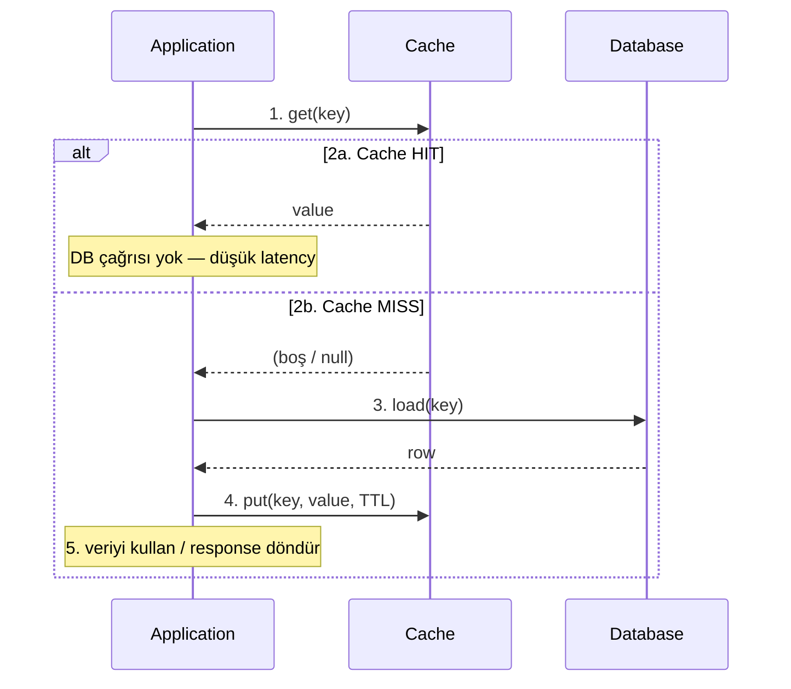

# Cache-Aside Pattern

System design'da veriyi yönetmek ve okuma performansını artırmak için kullanılan bir **caching stratejisi**. **Lazy Loading** (tembel yükleme) olarak da bilinir: veri cache'e, yalnızca uygulama ilk kez ihtiyaç duyduğunda yazılır.

---

## Temel kavramlar

Bu dokümanda sık geçen terimlerin tanımları. Cache-aside akışını okumadan önce bu bölümü referans alabilirsiniz.

### Latency (gecikme)

Bir isteğin **başlangıcından**, istemciye anlamlı yanıt dönene kadar geçen süredir (genelde ms cinsinden ölçülür).

| Kaynak | Tipik gecikme | Not |
|--------|----------------|-----|
| Cache hit (Redis, bellek) | ~0,1–2 ms | Ağ + serileştirme dahil |
| Cache miss + DB sorgusu | ~10–500+ ms | Disk I/O, connection pool, sorgu karmaşıklığı |
| Simüle edilmiş yavaş DB (Level 1) | +150 ms | `level1.db.simulated-latency-ms` |

Cache-aside'ın temel vaadi: sık okunan veride **ortalama latency'yi düşürmek**. İlk istek (miss) genelde yavaştır; sonraki istekler (hit) hızlıdır.

---

### TTL (Time To Live — yaşam süresi)

Bir cache kaydının **ne kadar süre geçerli kalacağını** belirler. Süre dolunca key otomatik silinir veya “ölü” sayılır; sonraki okuma **cache miss** üretir.

- **Amaç:** Bellek sınırını korumak, çok eski veriyi sınırlı süre tutmak.
- **Trade-off:** Kısa TTL → daha taze veri, daha çok miss. Uzun TTL → daha az DB yükü, daha yüksek stale riski.
- **Level 1:** `level1.cache.ttl-seconds: 30` — her `level1:product:{id}` key'i 30 saniye sonra düşer.

TTL, **eviction politikasından farklıdır**: TTL süreye göre siler; LRU/LFU kullanım sıklığına göre siler (kapasite dolduğunda).

---

### Evict (çıkarma / silme)

Cache'ten bir veya daha fazla kaydın **bilinçli veya kurala bağlı olarak kaldırılması**.

| Tür | Ne zaman | Örnek |
|-----|----------|--------|
| **Manuel evict** | Uygulama veya operatör siler | Level 1: `DELETE /api/admin/cache/products/{id}` → `[CACHE EVICT]` |
| **TTL expiry** | Süre doldu | Redis `TTL` 0'a iner |
| **Policy eviction** | Kapasite doldu, LRU/LFU devreye girer | Redis `maxmemory` + `volatile-lru` vb. |

Evict sonrası bir sonraki okuma **miss** olur ve veri yeniden DB'den yüklenir (cache population).

---

### LRU (Least Recently Used)

Kapasite dolduğunda **en uzun süredir okunmayan / kullanılmayan** kayıtların önce silindiği eviction politikası.

- Her erişimde kayıt “en son kullanıldı” olarak işaretlenir.
- Bellek dolduğunda listenin **en eski (en az güncel)** ucu temizlenir.
- **Ne zaman mantıklı:** Son dönemde popüler olan veri tekrar popüler olacaksa (ör. haber feed, ürün detayı).

Redis örneği: `maxmemory-policy allkeys-lru`

---

### LFU (Least Frequently Used)

Kapasite dolduğunda **en az sık erişilen** kayıtların önce silindiği eviction politikası.

- Her kayıt için erişim **sayacı** tutulur; periyodik veya ağırlıklı olarak azaltılabilir.
- **Ne zaman mantıklı:** Nadiren ama uzun süre popüler kalan “ağır” kayıtlar varsa; kısa süreli spike'lar LRU'da kalıcı kirletme yapabilir.
- LRU'ya göre daha karmaşık; sayaç sıfırlama (aging) gerekebilir.

Redis örneği: `maxmemory-policy allkeys-lfu`

---

### Through (Read-Through / Write-Through)

“Through” = uygulama **doğrudan DB ile değil**, öncelikle **cache katmanı üzerinden** konuşur; cache, DB ile koordinasyonu üstlenir. **Cache-aside'dan farklıdır.**

#### Read-Through

```
Application ──► Cache ──► (miss ise) Database
                ▲
                └── hit ise doğrudan döner
```

- Uygulama **sadece cache'e** `get` der.
- Miss'te **cache katmanı** DB'yi çağırır, sonucu cache'e yazar ve uygulamaya döner.
- Uygulama DB'yi bilmez (soyutlama yüksek).

#### Write-Through

```
Application ──► Cache ──► Database
              (yazma her iki yere de gider)
```

- Yazma önce veya eşzamanlı olarak **cache + DB** güncellenir.
- Tutarlılık daha güçlü; yazma latency'si genelde daha yüksek.

#### Cache-aside ile karşılaştırma

| Desen | Okuma miss'te kim DB'ye gider? | Yazmada kim yönetir cache? |
|--------|--------------------------------|-----------------------------|
| **Cache-aside** | **Uygulama** | **Uygulama** (invalidate / put / TTL) |
| **Read-through** | Cache katmanı | — |
| **Write-through** | — | Cache katmanı (+ DB) |
| **Write-behind** | — | Cache önce yazar; DB asenkron güncellenir |

Level 1 **cache-aside** kullanır: `ProductCacheAsideService` hem cache hem DB'yi doğrudan çağırır.

---

### İlgili kısa terimler

| Terim | Anlam |
|--------|--------|
| **Cache hit** | Key cache'te var; DB'ye gidilmeden yanıt üretilir |
| **Cache miss** | Key yok veya süresi dolmuş; veri kaynağından (DB) yüklenir |
| **Cache population** | Miss sonrası DB sonucunun cache'e yazılması |
| **Invalidation** | DB güncellendiğinde ilgili cache kaydının silinmesi veya güncellenmesi |

---

Bu repodaki **Level 1** modülü (`level-1-cache-aside`) cache-aside'ı bilinçli olarak sade tutar: Redis → PostgreSQL → populate. Stampede koruması, warming ve write-path invalidation yoktur — detaylar için [README.md](./README.md).

---

## Cache-Aside nedir?

Uygulama veriye ihtiyaç duyduğunda **önce cache'e**, orada yoksa **ana veritabanına** bakar. DB'den gelen sonucun bir kopyasını cache'e yazar; sonraki istekler mümkün olduğunca cache'ten karşılanır.

**Önemli:** Cache katmanı pasiftir — cache kendiliğinden DB'ye gitmez. Okuma/yazma kararını **uygulama kodu** verir.

### Akış (okuma)



ASCII özet (aynı akış):

```
     ┌─────────────────────────────────────────────────────────┐
     │                      APPLICATION                        │
     └───────────────────────────┬─────────────────────────────┘
                                 │
                    ① get(key)   │
                                 ▼
                          ┌──────────┐
                          │  CACHE   │
                          └────┬─────┘
                               │
              ┌────────────────┴────────────────┐
              │                                 │
         ②a HIT                           ②b MISS
    (value döner)                    (cache boş / expired)
              │                                 │
              │                                 ▼
              │                          ┌──────────┐
              │                          │    DB    │
              │                          └────┬─────┘
              │                               │
              │                          ③ load(key)
              │                               │
              │                          ④ put(key, value)
              │                               │
              └───────────────┬───────────────┘
                              │
                         ⑤ response
```

| Adım | Terim | Ne olur |
|------|--------|---------|
| 1 | **Cache lookup** | Uygulama cache'e `get(key)` yapar |
| 2a | **Cache hit** | Veri bulunur → hemen döner; DB ve düşük latency |
| 2b | **Cache miss** | Veri yok veya TTL dolmuş → DB yoluna girilir |
| 3 | **Load** | Uygulama ana veritabanından kaydı okur |
| 4 | **Cache population** | DB sonucu cache'e yazılır (`put` + TTL) |
| 5 | **Data usage** | Veri işlenir ve istemciye yanıt oluşturulur |

### Yazma (tipik cache-aside)

Yazma işlemlerinde uygulama genelde **önce DB'yi günceller**. Cache'i ya siler (**invalidation** / **evict**), ya günceller, ya da **TTL** ile eskiyip düşmesini bekler. Bu modülde write-path invalidation kasıtlı olarak yoktur — stale cache **Level 2**'de ele alınır.

---

## Performansı nasıl artırır?

| Etki | Açıklama |
|------|----------|
| **Daha hızlı okuma** | Hit'lerde veri bellekten (Redis) gelir; ortalama **latency** düşer |
| **DB yükünün azalması** | Okumaların önemli kısmı cache'e kayar |
| **Ölçeklenebilirlik** | Trafik arttıkça okuma yükü cache katmanına dağıtılabilir |
| **Throughput** | DB yazma ve karmaşık sorgular için kapasite kalır |

Yanlış **TTL**, invalidation eksikliği veya stampede gibi durumlarda kazanç kaybolabilir.

---

## Temel ilkeler

1. **Lazy loading** — Veri ilk miss'te DB'den alınır; **cache warming** ayrı stratejidir.
2. **Cache ayrı katman** — Uygulama cache ve DB ile ayrı konuşur (`ProductCacheAsideService` + `ProductRedisCache`).
3. **Okuma uygulama yönetir** — Read-through değil; miss'te uygulama DB'yi çağırır.
4. **Yazma genelde DB önce** — Write-through değil; cache sonradan evict / put / TTL ile hizalanır.
5. **Eviction + TTL** — Kapasite ve tazelik için LRU/LFU/TTL/evict birlikte kullanılır.
6. **Eventual consistency** — Cache ile DB kısa süre farklı olabilir; invalidation ve TTL ile yönetilir.

---

## Bu repoda nasıl görülür?

Level 1'de beklenen log sırası (ör. `product id=1`):

1. `GET /api/products/1` → `[CACHE MISS]` → `[DB QUERY EXECUTED]` → `[CACHE PUT]`
2. `GET /api/products/1` → `[CACHE HIT]` (DB logu yok)
3. `DELETE /api/admin/cache/products/1` → `[CACHE EVICT]`
4. `GET /api/products/1` → miss + DB tekrar

İlgili kod: `ProductCacheAsideService`, `ProductRedisCache`.

---

## Cache-aside'ın bilinen riskleri (kısa)

| Risk | Kısa açıklama | Bu repoda |
|------|----------------|-----------|
| **Stale cache** | DB güncellendi, cache eski kaldı | Level 2 |
| **Cache stampede** | Aynı key için çok sayıda eşzamanlı miss → DB'ye yığılma | Level 3 |
| **Hot key** | Tek key'e aşırı trafik | Level 4 |
| **Cache penetration** | Olmayan key'ler sürekli DB'ye gider | İleri seviye |

---

## Spring `@Cacheable` ile ilişki

`@EnableCaching` + `@Cacheable` kullanıldığında da **özde cache-aside** uygulanır. Hit/miss adımları framework arkasında kalır; bu lab gibi adım adım log için **manuel implementasyon** daha öğreticidir.

---

## Özet

**Cache-aside:** Uygulama okumada önce cache'e bakar; miss'te DB'den yükler, cache'i doldurur ve veriyi kullanır. **Latency** hit'lerde düşer; **TTL** ve **evict** tazelik ve kapasiteyi yönetir; **LRU/LFU** kapasite dolduğunda hangi kayıtların gideceğini belirler. **Read/Write-through** ise bu sorumluluğu cache katmanına devreder — Level 1 bilinçli olarak cache-aside seçer.
