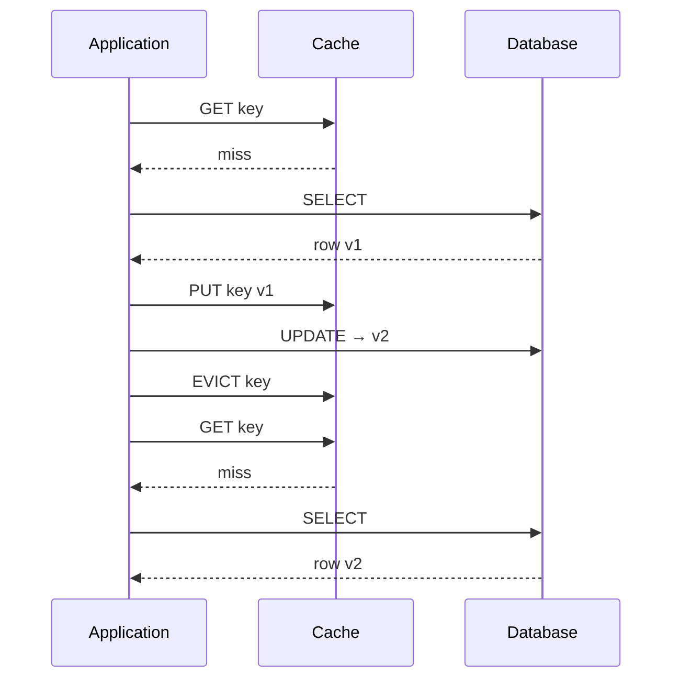
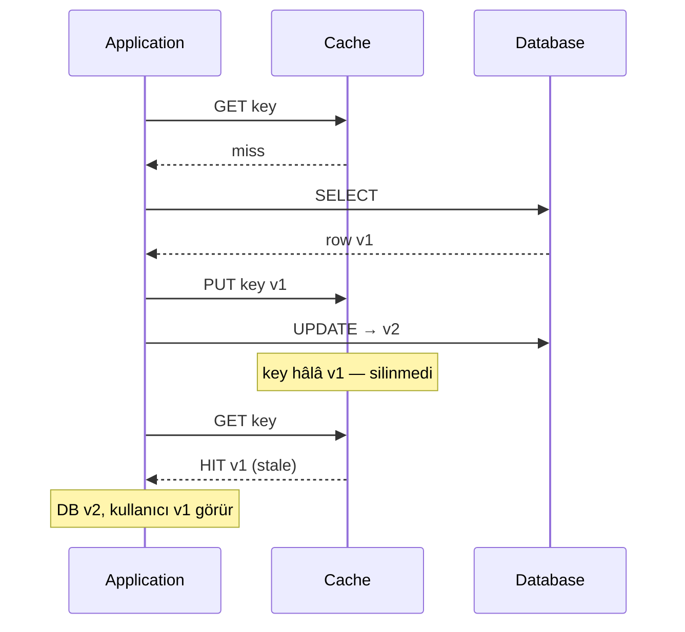

# Cache Invalidation

Cache'teki veri **güncelliğini yitirdiğinde** (stale / outdated), o kaydın cache belleğinden **çıkarılması veya güncellenmesi** işlemidir. Kaynak veri (ör. PostgreSQL) değiştiği hâlde cache'te eski kopya kalırsa **veri tutarsızlığı (data inconsistency)** oluşur; invalidation bu riski yönetir.

Bu repodaki **Level 2** modülü (`level-2-cache-invalidation`) kasıtlı olarak **invalidation yapmaz** — stale cache'i gözlemlemek için. Detaylar: [README.md](./README.md) · [problems-explain.md](./problems-explain.md)

---

## Cache invalidation nedir?

**Cache invalidation**, cache'te tutulan bir kopyanın artık kaynak veriyi yansıtmadığı durumda o kaydı **geçersiz kılma** sürecidir. Pratikte bu genelde:

- Cache entry'nin **silinmesi** (flush / evict / delete), veya  
- Cache entry'nin **yeni değerle güncellenmesi** (write-through / cache put)

anlamına gelir.

> Cache invalidation = “Bu key artık güvenilir değil; bir sonraki okuma kaynaktan tazelensin veya cache doğru değerle dolsun.”

Kaynak veri değiştiğinde invalidation yapılmazsa, uygulama cache'e güvenmeye devam eder ve **yanlış veya eski sonuç** üretebilir.

---

## Stale cache (bayat veri)

| Terim | Anlam |
|--------|--------|
| **Stale** | Cache'teki kopya, DB'deki güncel veriden **eski** |
| **Invalid** | Cache kaydı artık **kullanılmamalı** (silinmeli veya yenilenmeli) |
| **Inconsistency** | Okuyanlar DB ile cache arasında **farklı gerçeklik** görür |

Örnek: Ürün fiyatı DB'de `99.00` → `1.99` olur; cache hâlâ `99.00` tutuyorsa her `GET` stale fiyat döner.

---

## Neden önemli?

Caching, sık erişilen verinin bir kopyasını bellekte (Redis vb.) tutarak **okuma hızını** artırır. Ancak kaynak veri değiştiğinde cache kopyası **otomatik olarak** güncellenmez (özellikle cache-aside'da).

Invalidation yapılmazsa:

| Sonuç | Açıklama |
|--------|----------|
| **Yanlış iş kararları** | Eski fiyat, stok, limit bilgisi |
| **Kullanıcı güven kaybı** | “Az önce güncelledim, hâlâ eski görünüyor” |
| **Performans yanılsaması** | Hit ratio yüksek görünür ama hit'ler **stale** |
| **Hata ayıklama zorluğu** | DB doğru, API yanlış — iki “gerçek” |

Özet: Cache hız kazandırır; **invalidation tutarlılık** sağlar. İkisi birlikte düşünülmezse cache zararlı hale gelir.

---

## Invalidation vs eviction

| | **Invalidation** | **Eviction** |
|---|------------------|--------------|
| **Amaç** | Tutarlılık — veri **değişti**, kopya artık geçersiz | Kapasite — bellek **doldu**, yer aç |
| **Tetikleyici** | Update/delete, iş kuralı, mesaj | LRU, LFU, TTL, `maxmemory` |
| **Sonuç** | Doğru veri için miss veya güncel put | Eski/azar kayıt silinir |

TTL hem eviction hem “zayıf invalidation” sayılabilir: süre dolunca key gider, ama **ne zaman** DB ile uyumsuz kaldığını bilmez — sadece süreye bakar.

---

## Cache invalidation yöntemleri

Doğru ve güncel cache verisi için kullanılan başlıca teknikler. Her yöntemin artıları ve zorlukları farklıdır; çoğu production sisteminde **birkaçının birlikte** kullanılması gerekir.

| # | Yöntem | Kısa özet | Tipik kullanım |
|---|--------|-----------|----------------|
| 1 | Zaman tabanlı | Süre dolunca geçersiz | Seyrek değişen veri |
| 2 | Key tabanlı | Veri değişince ilgili key silinir/güncellenir | Sık güncellenen kayıt |
| 3 | Write-through | Önce DB, sonra cache | Güçlü tutarlılık |
| 4 | Write-behind | Önce cache, DB asenkron | Yüksek yazma hızı |
| 5 | Purge | Belirli içerik anında silinir | CDN, edge cache |
| 6 | Refresh | Origin'den çek, cache'i güncelle | Arka planda tazeleme |
| 7 | Ban | Pattern/kural ile toplu silme | URL prefix, header |
| 8 | TTL expiration | Her key için yaşam süresi | Redis, Spring Cache |
| 9 | Stale-while-revalidate | Eskiyi ver, arkada yenile | CDN, HTTP Cache-Control |

---

### 1. Zaman tabanlı invalidation (Time-based)

Cache'e yazılan veriye bir **son kullanma süresi** konur. Süre dolunca kayıt geçersiz sayılır; sonraki istek kaynaktan (DB / origin) yeniden yüklenir.

**Artıları**
- Uygulaması basit
- Nadiren değişen veri için etkili (config, kategori listesi)

**Zorlukları**
- Süre **çok uzun** → stale veri servis edilir
- Süre **çok kısa** → gereksiz refresh, DB yükü artar

**Level 2:** `spring.cache.redis.time-to-live: 10m` — zaman tabanlı; update sonrası bile TTL bitene kadar stale kalabilir.

---

### 2. Key tabanlı invalidation (Key-based)

Her cache kaydı benzersiz bir **key** ile ilişkilidir. Kaynak veri değiştiğinde yalnızca o key **silinir veya güncellenir** — tüm cache temizlenmez.

```
PUT product/42 → DB güncelle → cache.delete("product:42")  veya  @CacheEvict
```

**Artıları**
- Sık değişen veride güncel kalma
- Hedefli invalidation; gereksiz miss azalır

**Zorlukları**
- Time-based'e göre daha fazla uygulama mantığı
- Key tasarımı ve invalidation kapsamı (ilişkili kayıtlar) düşünülmeli

Spring örneği (**Level 2'de kasıtlı olarak yok**):

```java
@CacheEvict(cacheNames = "products", key = "#id")
public void updatePrice(long id, UpdatePriceRequest req) { ... }
```

---

### 3. Write-through invalidation

Yazma önce **kaynak veritabanına**, ardından **cache'e** (veya eşzamanlı) uygulanır. Cache, DB ile aynı commit sonrası güncellenir veya eski key silinir.

**Artıları**
- Cache verisi güncel kalma olasılığı yüksek
- Stale riski düşük

**Zorlukları**
- Yazma latency'si artar (DB + cache bekleme)
- Cache-aside'a göre daha sıkı entegrasyon gerekir

---

### 4. Write-behind invalidation

Yazma önce **cache'e** yansır; kaynak (DB) **asenkron** güncellenir. Okuma hızlıdır; tutarlılık penceresi oluşur.

**Artıları**
- Yüksek yazma throughput'u
- Uygulama DB gecikmesini beklemez

**Zorlukları**
- Cache ile DB **geçici uyumsuz** olabilir
- Hata / çökme durumunda kayıp veya stale riski (queue, retry gerekir)

---

### 5. Purge invalidation

Belirli bir nesne, URL veya URL grubuna ait **tüm cache içeriği anında silinir**. Sonraki istek doğrudan origin'e gider.

**Artıları**
- İlgili içerik tamamen kaldırılır; “eski kopya kalmadı” garantisi güçlü

**Zorlukları**
- Büyük key set'lerinde yavaş ve kaynak yoğun olabilir
- Yanlış purge → geçici trafik spike'ı veya servis kesintisi (CDN senaryoları)

**Not:** Çoğunlukla **CDN / edge cache** (Cloudflare, Fastly, Varnish) terminolojisidir; uygulama Redis'inde `DEL` veya `FLUSH` ile benzer etki.

---

### 6. Refresh invalidation

Cache'te veri olsa bile origin'den **güncel içerik çekilir** ve mevcut cache entry **üzerine yazılır** (purge'dan fark: silmez, günceller).

**Artıları**
- Sonraki istekler güncel cache'ten karşılanır
- Purge'a göre “boşluk” anı daha kısa olabilir

**Zorlukları**
- Refresh sırasında origin'e ek yük (traffic spike)
- Eşzamanlı refresh → thundering herd riski

---

### 7. Ban invalidation

URL pattern, header veya başka **kriterlere uyan** tüm cache kayıtları geçersiz kılınır. Purge tek kayıt/grup; ban **koşullu toplu** silmedir.

**Artıları**
- Tüm cache'i temizlemeden seçici invalidation
- “`/api/products/*` güncellendi” gibi pattern senaryoları

**Zorlukları**
- Kural motoru ve eşleştirme overhead'i
- Yanlış pattern → fazla veya az invalidation

---

### 8. TTL expiration (Time-To-Live)

Her cache entry'ye bir **TTL** verilir. İstek geldiğinde TTL geçerliyse cache servis eder; süresi dolmuşsa origin'den taze kopya alınır ve cache yenilenir.

**Zaman tabanlı (§1) ile ilişki:** TTL, zaman tabanlı invalidation'ın pratikteki en yaygın implementasyonudur (Redis `EXPIRE`, Spring `time-to-live`).

**Artıları**
- Belirli süre sonra otomatik invalidation
- Ek iş mantığı gerektirmeden “yaklaşık tazelik”

**Zorlukları**
- TTL uzunsa update ile TTL arasında **stale pencere** (Level 2 tam bunu gösterir)
- Veri değişim sıklığına göre TTL ayarı zor

---

### 9. Stale-while-revalidate

İstek geldiğinde **mevcut (hafif eski) cache cevabı hemen** döner; arka planda origin'den güncel kopya çekilir ve cache sessizce güncellenir. HTTP `Cache-Control: stale-while-revalidate` ile bilinir.

**Artıları**
- Düşük latency — kullanıcı her zaman hızlı cevap alır
- Origin yükü arka plana yayılır

**Zorlukları**
- Kısa süre **bilinçli olarak stale** veri servis edilir
- Tutarlılık kritikse (fiyat, stok) dikkatli kullanılmalı

---

### Ek: Event-driven invalidation

Yukarıdaki listede ayrı madde değil ama production'da sık kullanılır: DB veya domain event'i (Kafka, RabbitMQ) → tüm uygulama instance'ları ilgili key'i siler. **Key tabanlı** invalidation'ın dağıtık hali.

---

## Akış: doğru vs hatalı (Level 2)

### Doğru invalidation (hedef davranış)



### Level 2 — invalidation yok (stale)



---

## Bu repoda nasıl görülür?

Level 2 logları (`application.yml` → `lab.cache`, `lab.db`):

| Log | Anlam |
|-----|--------|
| `[CACHE NOT INVALIDATED]` | PUT sonrası cache'e dokunulmadı |
| `[STALE CACHE DETECTED]` | Güncelleme sonrası GET hâlâ eski cache'ten |
| `[DB QUERY EXECUTED]` | Sadece cache miss'te |

Kod:

| Sınıf | Rol |
|-------|-----|
| `ProductCacheLoader` | `@Cacheable` okuma |
| `ProductService.updatePrice` | DB günceller — **`@CacheEvict` yok** |

**Senaryo:** `http/stale-cache.http` — GET → GET → PUT → GET (son GET eski fiyat).

---

## Ne zaman hangi yöntem?

| Senaryo | Önerilen yöntem(ler) |
|---------|----------------------|
| Tek kayıt güncellenir (ürün, kullanıcı) | **Key tabanlı** — `@CacheEvict` / `delete(key)` |
| Nadiren değişen referans veri | **TTL** / zaman tabanlı |
| Güçlü yazma tutarlılığı | **Write-through** |
| Yüksek yazma hızı, stale tolere | **Write-behind** (+ event ile düzeltme) |
| CDN / statik içerik | **Purge**, **ban**, **refresh** |
| Düşük latency, hafif stale OK | **Stale-while-revalidate** |
| Çok instance, aynı key | **Key tabanlı** + **event-driven** |
| Level 2 lab (kasıtlı hata) | **Hiçbiri** — update cache'e dokunmaz |

---

## Özet

**Cache invalidation**, kaynak veri değiştiğinde cache'teki eski kopyayı **silme veya güncelleme** işlemidir. Zaman tabanlı, key tabanlı, write-through/behind, purge, refresh, ban, TTL ve stale-while-revalidate gibi yöntemler farklı **tutarlılık / hız** dengeleri sunar; production'da genelde **key tabanlı + TTL** birlikte kullanılır.

Level 2, **key tabanlı invalidation yapılmadığında** (PUT sonrası `@CacheEvict` yok) oluşan stale cache'i gösterir. Çözüm için doğru yöntemi seçmek, verinin değişim sıklığına ve tutarlılık gereksinimine bağlıdır.
